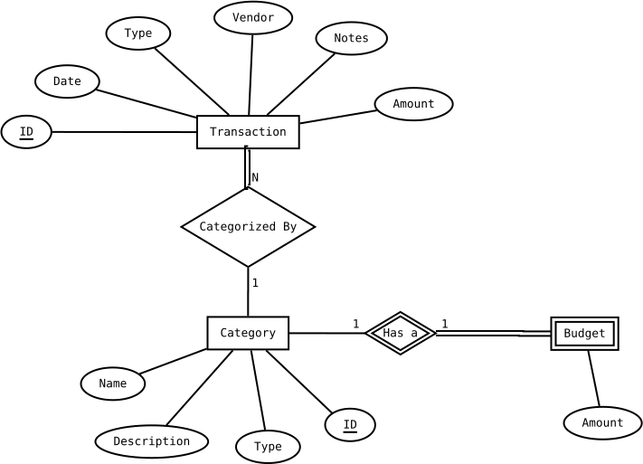

# Data Model

## ER Diagram

---

## Entities

### Transaction
Represents a single financial event — either an expense or an income entry logged by the user.

| Column | Type | Constraint | Description |
|---|---|---|---|
| `id` | INTEGER | PK | Unique identifier |
| `amount` | DECIMAL | NOT NULL | Value of the transaction |
| `type` | TEXT | NOT NULL | `EXPENSE` or `INCOME` |
| `date` | DATE | NOT NULL | Date the transaction occurred |
| `vendor` | TEXT | | Name of the vendor or income source/payer |
| `notes` | TEXT | | Optional free-text note |
| `category_id` | INTEGER | FK → Category, NOT NULL | The category this transaction belongs to |

---

### Category
Represents a user-defined classification for transactions. All transactions must be assigned to a category.

| Column | Type | Constraint | Description |
|---|---|---|---|
| `id` | INTEGER | PK | Unique identifier |
| `name` | TEXT | NOT NULL, UNIQUE | Display name of the category |
| `description` | TEXT | | Optional notes describing what belongs in this category |
| `type` | TEXT | NOT NULL | `EXPENSE` or `INCOME` — determines which transactions can be assigned to it |

---

### Budget *(weak entity)*
Represents a monthly spending target for an expense category. A budget cannot exist without its owning category.

| Column | Type | Constraint | Description |
|---|---|---|---|
| `category_id` | INTEGER | PK, FK → Category | The category this budget target belongs to |
| `monthly_amount` | DECIMAL | NOT NULL | The monthly budget target amount |

---

## Relationships

| Relationship | Entities | Cardinality | Participation | Notes |
|---|---|---|---|---|
| categorized by | Transaction → Category | Many-to-one (N:1) | Transaction: total · Category: partial | Every transaction must have a category; a category can exist with no transactions |
| targets | Category → Budget | One-to-one (1:1) | Category: partial · Budget: total | A category may optionally have one budget target; a budget cannot exist without its category |

---

## Notes

- **Budget** is a weak entity — its identity depends entirely on its owning Category. It uses `category_id` as both its primary key and foreign key.
- The `type` field on both **Transaction** and **Category** must be consistent — an `INCOME` transaction should only be assigned to an `INCOME` category and vice versa. This constraint should be enforced at the application layer.
- Budget targets are a fixed monthly amount applied uniformly across all months. Per-month budget overrides are out of scope for MVP.
